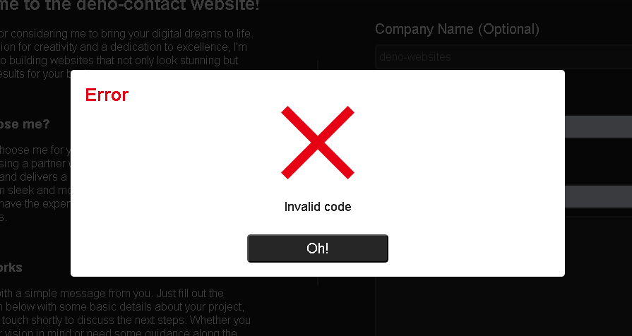

# deno-contact

deno-Contact is a lightweight and secure website designed for easy email communication via form. Built with JavaScript, it utilizes Docker for deployment, Webpack for optimization, and Nodemailer for email handling. Connect effortlessly with me.


## Demo


## Technologies

**Client-Side:** 
- JavaScript, HTML, CSS
- jQuery@^3.7.1

**Server-Side:**
- Node.js@^21.7.1
- Express@^4.18.2
- Nodemon@^3.1.0
- MongoDB@^6.3.0
- Webpack@^5.90.3
- Nodemailer@^6.9.10
- Docker@^25.0.3
- PM2@^5.3.1
- Node-cron@^3.0.3

## Installation

Clone deno-contact from the repository

```bash
  git clone git@github.com:DenoneroDev/deno-contact.git
```
    
## Environment Variables

Before running the project, add the following environment variables to your `.env` file:


- `NODEMAILER_EMAIL`
- `NODEMAILER_PASSWORD`
- `MONGODB_URI`
- `PORT`
- `BASE_DATABASE_NAME`
## Run Locally
**Before running**

Ensure all dependencies are downloaded and the frontend is bundled

```bash
  npm install
  npm run bundle:prod
```
**Run with Docker**
```bash
  docker build -t <image_name> .
  docker run --name <container_name> -p 4000:4000 <image_name>
```
**Run with NPM**
```bash
npm start
```
## Running Tests

To run tests with Jest:

```bash
  npm run test
```


## Feedback

If you have any feedback, please reach out to me at denonerodev@gmail.com


## Screenshots





## License

[MIT](https://choosealicense.com/licenses/mit/)

